# 🏬 MAGASIN IT — Application de gestion du magasin informatique

> Application web de **gestion du parc et du stock de matériel informatique** : réception des livraisons fournisseurs, entrée en stock à l'unité (numéro de série), attribution du matériel aux employés, sorties temporaires, et inventaire consolidé avec statistiques et export PDF.


---

## 📑 Sommaire

1. [À quoi sert cette application ?](#-à-quoi-sert-cette-application-)
2. [Contexte de création](#-contexte-de-création)
3. [Fonctionnalités](#-fonctionnalités)
4. [Aperçu de l'application](#-aperçu-de-lapplication)
5. [Architecture](#-architecture)
6. [Le Backend en détail](#-le-backend-en-détail)
7. [Pourquoi ces choix techniques et pas d'autres ?](#-pourquoi-ces-choix-techniques-et-pas-dautres-)
8. [Modèle de données](#-modèle-de-données)
9. [Référence de l'API REST](#-référence-de-lapi-rest)
10. [Installation et démarrage](#-installation-et-démarrage)
11. [Structure du projet](#-structure-du-projet)
12. [Limites connues et pistes d'amélioration](#-limites-connues-et-pistes-damélioration)
13. [Auteur](#-auteur)

---

## 🎯 À quoi sert cette application ?

Dans une entreprise, le **magasin IT** est le service qui reçoit, stocke et distribue tout le matériel informatique : ordinateurs portables, écrans, souris, claviers, imprimantes, onduleurs, câbles, etc.

Sans outil dédié, ce suivi se fait généralement sur des **fichiers Excel** ou des **cahiers papier**, ce qui pose quatre problèmes récurrents :

| Problème du suivi manuel | Réponse apportée par l'application |
|---|---|
| On ne sait plus **qui détient quel matériel** | Chaque attribution est reliée au **matricule** d'un employé, avec la caractéristique complète du matériel (marque, modèle, n° de série) |
| Les **numéros de série se dupliquent** ou se perdent | Contrainte d'unicité en base **+** vérification côté serveur avant chaque insertion |
| L'**inventaire ne tombe jamais juste** | Table `Inventaire` recalculée automatiquement : `Entrées − Attributions − Sorties = Comparaison` |
| Aucune **traçabilité** de la chaîne fournisseur → employé | Chaîne complète : `Fournisseur → Livraison → Produit → Attribution / Sortie → Inventaire` |

**Concrètement, l'application permet de :**

- 📇 **Référencer les fournisseurs** (code, contact, localisation, n° de bon de commande) ;
- 🚚 **Enregistrer les livraisons** (bordereau, date de réception, objet, lot, désignation, **liste de numéros de série** stockée en JSON) ;
- 📦 **Entrer le matériel en stock** unité par unité, avec un statut `Neuf` / `Reformer` et un **numéro d'étagère** pour le retrouver physiquement ;
- 🧑‍💼 **Gérer le fichier des employés** (matricule, direction, fonction, localisation) ;
- 🖥️ **Attribuer du matériel** à un employé, à une unité ou à un projet, en distinguant le matériel **Nouveau** du matériel de **Récupération**, et en enregistrant l'état de l'ancienne machine rendue ;
- 📤 **Enregistrer les sorties temporaires** de matériel (motif, chauffeur, date de sortie, date de retour) ;
- 📈 **Consulter l'inventaire consolidé** avec variations mensuelles/annuelles, graphiques et **export PDF** ;
- 👨‍💻 **Administrer les comptes** qui ont accès à l'application ;
- 📱 **Travailler depuis un mobile** : l'application est une **PWA** installable, et la page de connexion affiche un **QR code** pointant vers l'adresse réseau du serveur pour se connecter depuis un téléphone du même réseau local.

---

## 🏢 Contexte de création

Ce projet a été réalisé dans le cadre d'un **travail de projet académique (parcours B1 → B3)**, adossé à un **besoin réel d'entreprise** : la gestion du magasin informatique d'**ENEO Cameroon** (société de distribution d'électricité du Cameroun), dont le logo et la charte graphique verte sont repris dans l'interface.

**Le cahier des charges de départ :**

- L'outil doit fonctionner **en réseau local (intranet)**, sans dépendre d'Internet — d'où le serveur Node/MySQL auto-hébergé et l'exposition sur `0.0.0.0` plutôt que sur un hébergeur cloud ;
- Il doit être utilisable **depuis un poste fixe comme depuis un téléphone** dans les allées du magasin — d'où le mode **PWA**, l'interface responsive et le **QR code** de connexion réseau ;
- Les gestionnaires doivent pouvoir **sortir des documents papier** (états de stock, inventaire, liste des employés) — d'où les exports **PDF** générés côté client ;
- La saisie doit être **contrainte** pour éviter les erreurs humaines : un numéro de série ne peut pas être saisi deux fois, un produit déjà attribué ne peut plus être proposé à l'attribution, un employé référencé dans une attribution ne peut pas être supprimé ;
- Tout doit rester **simple à déployer** par une équipe interne : une base MySQL, un script Node, un dossier `dist/` statique.

L'application est écrite **intégralement en français** (interface, messages d'erreur, noms de colonnes en base) pour correspondre au vocabulaire métier des utilisateurs finaux.

---

## ✨ Fonctionnalités

<details>
<summary><b>Module Fournisseurs</b></summary>

- CRUD complet (créer, lister, modifier, supprimer)
- Code fournisseur et n° de bon de commande **uniques**
- Suppression bloquée si le fournisseur possède des livraisons (intégrité référentielle `ON DELETE RESTRICT`)
- Recherche, filtres et tri
</details>

<details>
<summary><b>Module Livraisons</b></summary>

- Enregistrement d'un bordereau de livraison rattaché à un fournisseur
- Saisie **multiple** de numéros de série (séparés par virgule ou retour à la ligne), normalisés et stockés en colonne **JSON**
- Refus automatique des numéros de série déjà présents en base
- Formatage automatique des dates au format MySQL
- Synchronisation en cascade vers le stock lors d'une modification de livraison
</details>

<details>
<summary><b>Module Stock</b></summary>

- Un produit = **une unité physique** identifiée par son numéro de série
- Statut `Neuf` / `Reformer`, numéro d'étagère, date de mise à jour
- Compteurs en temps réel (total, neufs, réformés)
- Filtre `?excludeUsed=true` : n'affiche que le matériel **encore disponible**, c'est-à-dire ni attribué ni sorti
- Suppression bloquée si le produit est déjà attribué ou sorti
- Export PDF de l'état du stock
</details>

<details>
<summary><b>Module Attributions</b></summary>

- Mode d'utilisation : `INDIVIDUEL` / `UNITÉ` / `PROJET`
- Identification du matériel : `Nouveau` / `Récupération`
- Caractéristiques du matériel attribué **et** de l'ancien matériel repris, stockées en JSON
- État de l'ancienne machine : `Bon état` / `Cassé` / `En panne`
- Jointure automatique avec la fiche employé (nom, direction, fonction, localisation)
</details>

<details>
<summary><b>Module Sorties</b></summary>

- Sortie temporaire de matériel avec motif, nom du chauffeur, date de sortie et date de retour
- Filtres par date, matricule ou motif
- Caractéristiques du matériel sorti en JSON
</details>

<details>
<summary><b>Module Inventaire</b></summary>

- Consolidation par nom de produit : `total_entree`, `total_attribution`, `total_sortie`, `comparaison`
- Variations **mensuelles** et **annuelles**
- Onglets *Historique* et *Statistique* avec graphiques **Chart.js**
- Export PDF via **jsPDF + AutoTable**
- La date de mise à jour n'est modifiée **que si les valeurs changent réellement** (évite de polluer l'historique)
</details>

<details>
<summary><b>Module Employés & Administrateurs</b></summary>

- Fichier employés : matricule, nom, email, localisation, direction, fonction
- Suppression protégée : message explicite indiquant le nombre d'attributions et de sorties bloquantes
- Comptes administrateurs avec matricule et email uniques
- Connexion par **matricule + mot de passe**, session conservée en `localStorage`
</details>

---

## 🖼️ Aperçu de l'application

> Captures réalisées sur l'environnement de développement, avec un **jeu de données de test**.

### Connexion — identification par matricule (+ QR code de connexion mobile)
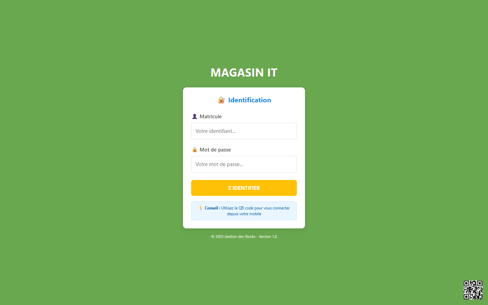

### Page d'accueil — les six modules de l'application
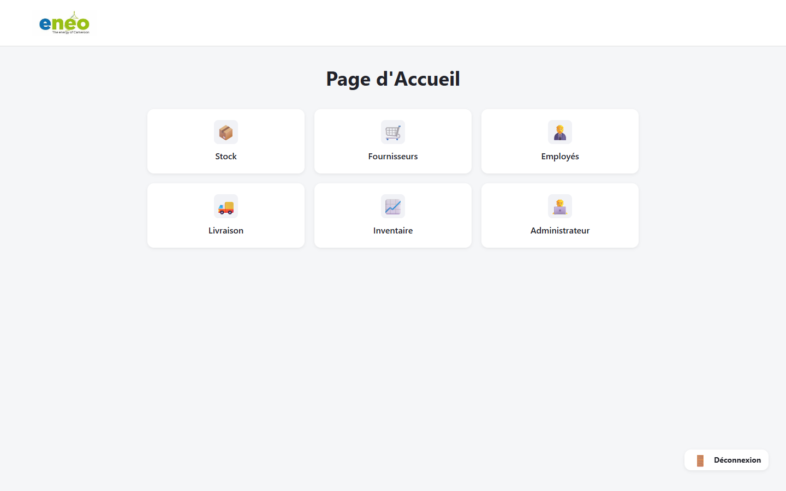

### Sous-menu Stock — Stock / Attribution / Sortie
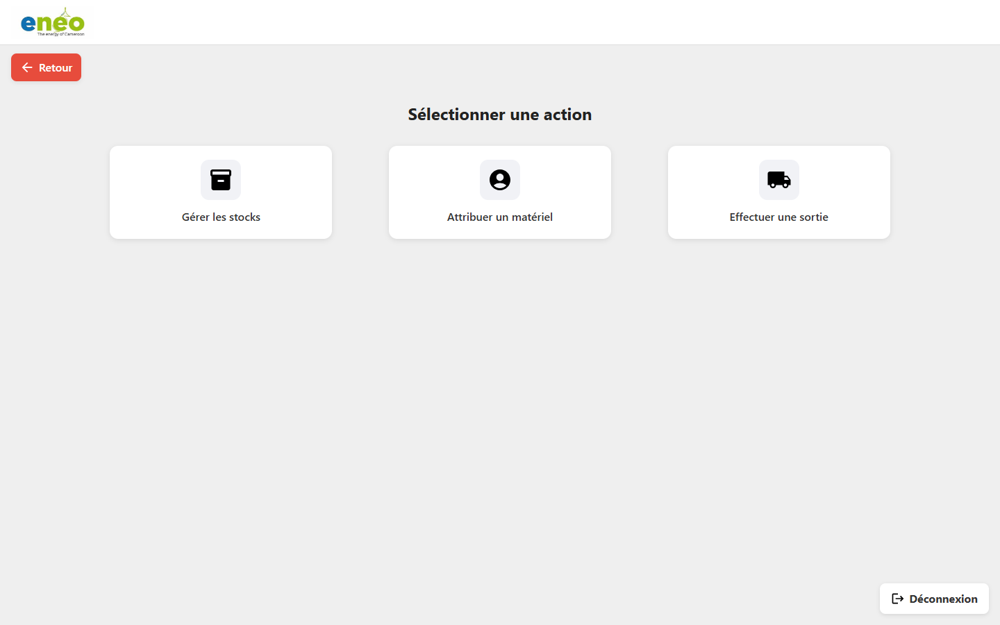

### Gestion des stocks — inventaire physique unité par unité
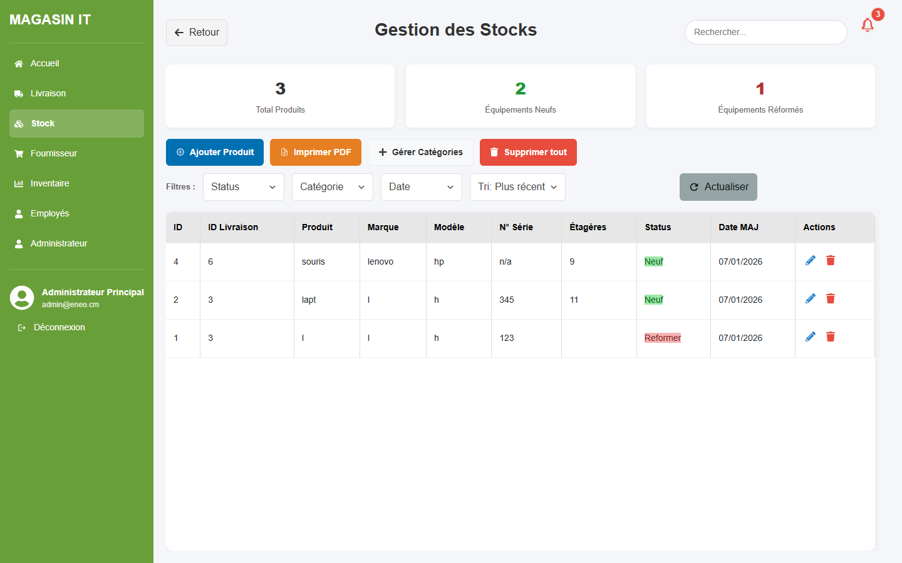

### Livraisons — bordereaux et numéros de série
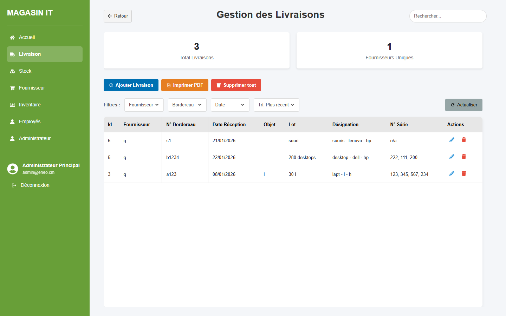

### Fournisseurs
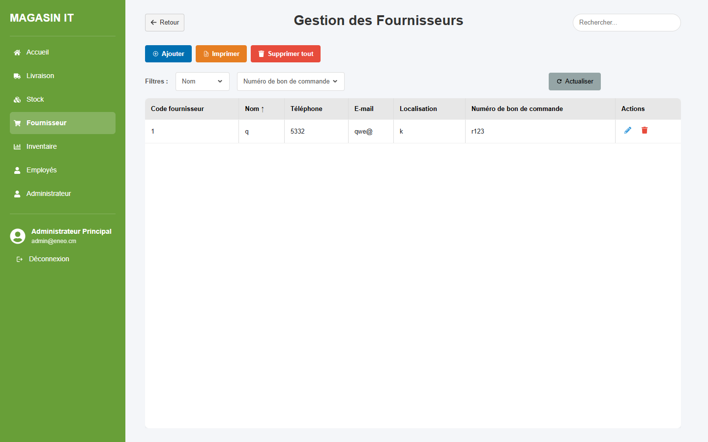

### Employés
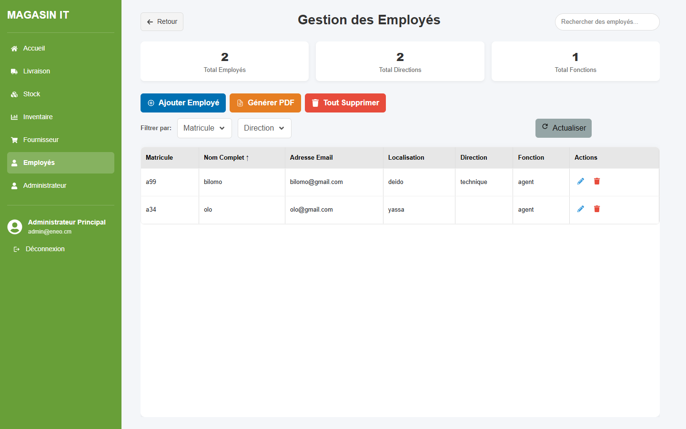

### Attributions — matériel affecté aux employés
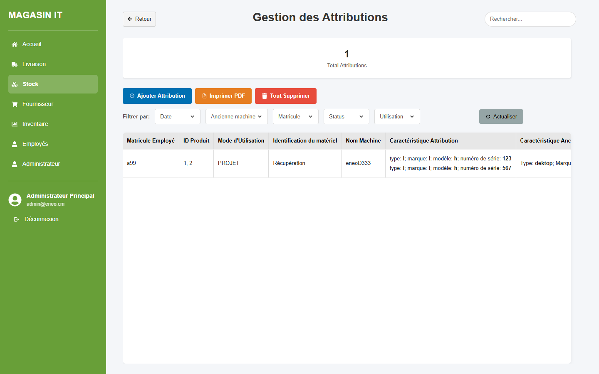

### Sorties de matériel
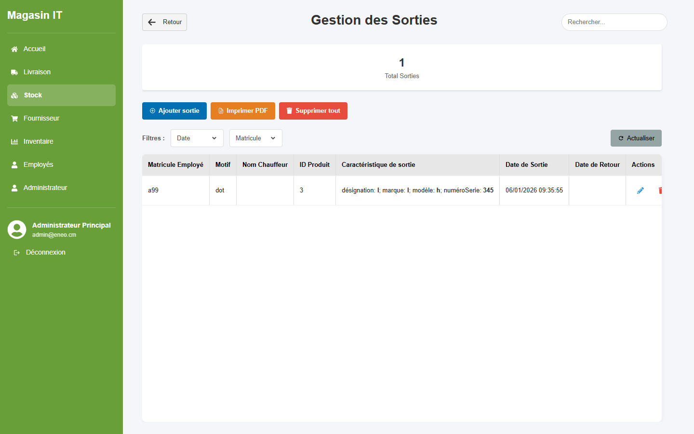

### Inventaire consolidé — historique, statistiques et export PDF
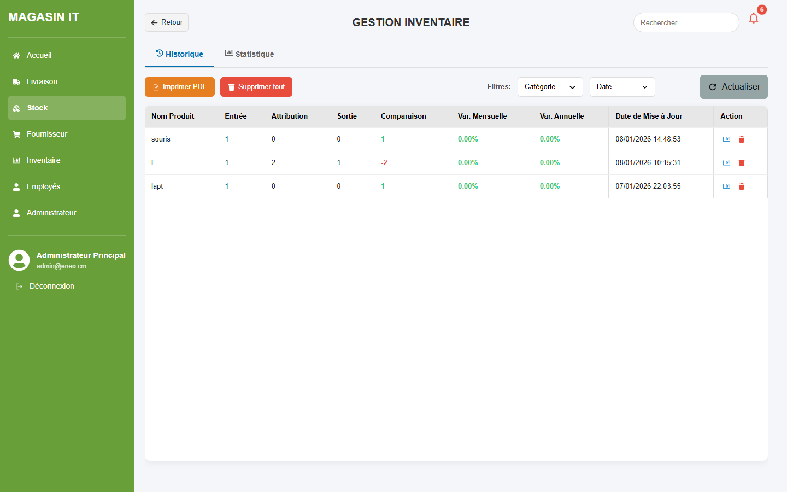

### Administrateurs
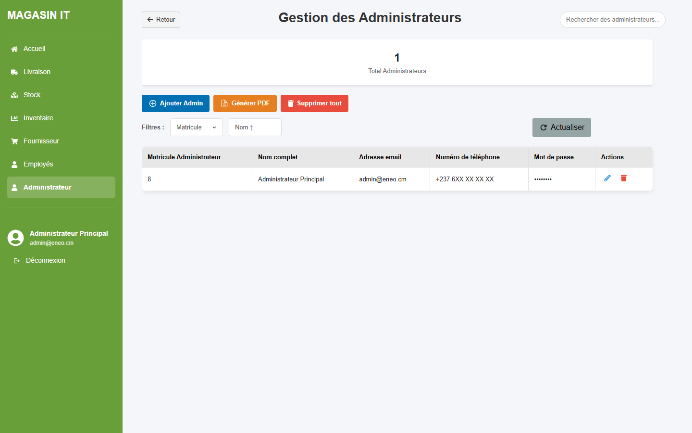

---

## 🏗️ Architecture

### Vue d'ensemble : une architecture 3-tiers client/serveur

```
┌──────────────────────────────────────────────────────────────────────┐
│  TIER 1 — PRÉSENTATION  (navigateur, poste fixe ou mobile)           │
│                                                                      │
│   React 19 + React Router 7  ·  Vite 7 (dev/build)  ·  PWA           │
│   Chart.js (graphiques)  ·  jsPDF + AutoTable (impression)           │
│   Axios / fetch (appels HTTP)                                        │
└───────────────────────────────┬──────────────────────────────────────┘
                                │  HTTP / JSON  (REST)
                                │  http://<ip-serveur>:3001/api/...
                                ▼
┌──────────────────────────────────────────────────────────────────────┐
│  TIER 2 — LOGIQUE MÉTIER  (serveur applicatif)                       │
│                                                                      │
│   Node.js  ·  Express 5  ·  server.cjs                               │
│   ├── Middlewares  : CORS, express.json, gestion d'erreurs           │
│   ├── Helpers      : queryAsync, getAllUsedProductIds,               │
│   │                  normalizeSerialsArray, findExistingSerials      │
│   ├── Routes       : /api/fournisseurs, /api/livraisons,             │
│   │                  /api/stocks, /api/produits, /api/employes,      │
│   │                  /api/attributions, /api/sorties,                │
│   │                  /api/administrateurs, /api/auth                 │
│   ├── Router monté : /api/inventaire  (express.Router)               │
│   └── Sync         : /api/sync/full-sync-from-livraison/:id          │
│                      /api/sync/from-stocks/:id_produit               │
└───────────────────────────────┬──────────────────────────────────────┘
                                │  Protocole MySQL  (driver mysql2)
                                │  requêtes préparées (?)
                                ▼
┌──────────────────────────────────────────────────────────────────────┐
│  TIER 3 — PERSISTANCE  (base de données)                             │
│                                                                      │
│   MySQL 8 — base `magasin_it`                                        │
│   8 tables · colonnes JSON · clés étrangères ON DELETE RESTRICT      │
│   2 vues · 2 triggers (mise à jour automatique de l'inventaire)      │
│   10 index de performance                                            │
└──────────────────────────────────────────────────────────────────────┘
```

### Flux fonctionnel — le cycle de vie d'un équipement

```
   Fournisseur
        │  fournit
        ▼
   Livraison  ──────► numero_Serie : ["SN001", "SN002", "SN003"]  (JSON)
        │  génère
        ▼
   Produit (stock)   1 ligne = 1 unité physique = 1 numéro de série
        │
        ├──────────────► Attribution   (affectation durable à un employé)
        │                     │
        └──────────────► Sortie        (sortie temporaire, avec date de retour)
                              │
                              ▼
                        Inventaire
                 total_entree − total_attribution − total_sortie = comparaison
```

### Pourquoi une architecture **découplée** (API REST) plutôt qu'un monolithe rendu côté serveur ?

| Critère | Architecture retenue (SPA + API REST) | Alternative (PHP/JSP rendu serveur) |
|---|---|---|
| **Réactivité** | Aucune rechargement de page, ressenti « application » | Rechargement complet à chaque action |
| **Mobile** | Le même backend sert la PWA et pourrait servir une future app native | Il faudrait tout redévelopper |
| **Séparation des responsabilités** | Le front ne connaît que des URL et du JSON | Logique métier et affichage mélangés |
| **Débogage** | Chaque endpoint testable seul (`curl`, Postman) | Difficile d'isoler la logique de la vue |
| **Coût** | Deux processus à démarrer | Un seul processus |

Le découplage a été retenu parce que la contrainte « utilisable depuis un téléphone dans les allées du magasin » rendait la PWA indispensable, et qu'une PWA impose un backend qui parle JSON.

---

## ⚙️ Le Backend en détail

Tout le backend tient dans **un seul fichier : [`server.cjs`](server.cjs)** (~1 885 lignes), organisé en sections commentées. Voici chaque élément qui le compose.

---

### 1. `express` — le framework HTTP

```js
const express = require('express');
const app = express();
const PORT = 3001;
```

**Rôle.** Express est le socle du serveur. Il fournit le routeur (`app.get`, `app.post`, `app.put`, `app.delete`), la chaîne de middlewares, et les objets `req` / `res` enrichis (`res.json()`, `res.status()`, `req.body`, `req.params`, `req.query`).

**Comment il a été mis en place.**
```bash
npm install express
```
Puis instanciation de l'application (`express()`), enregistrement des middlewares, déclaration des routes, et démarrage :
```js
app.listen(PORT, '0.0.0.0', () => { ... });
```
L'écoute sur `0.0.0.0` (et non sur `localhost`) est **volontaire** : c'est ce qui rend l'API joignable depuis les autres postes et les téléphones du réseau local.

**Version 5.** Express 5 a été choisi pour sa gestion native des erreurs dans les handlers `async`, très présents dans ce projet.

---

### 2. `mysql2` — le pilote de base de données

```js
const mysql = require('mysql2');

const db = mysql.createConnection({
  host:     process.env.DB_HOST     || 'localhost',
  user:     process.env.DB_USER     || 'root',
  password: process.env.DB_PASSWORD || 'root',
  database: process.env.DB_NAME     || 'magasin_it',
  port:     process.env.DB_PORT     || 3006,
});
```

**Rôle.** `mysql2` ouvre et maintient la connexion au serveur MySQL et exécute les requêtes SQL. Il gère les **requêtes préparées** (les `?` dans le SQL), ce qui protège l'application contre les **injections SQL** : les valeurs envoyées par le client ne sont jamais concaténées dans la chaîne SQL.

**Comment il a été mis en place.**
```bash
npm install mysql2
```
La configuration lit les variables d'environnement avec des valeurs par défaut de secours, ce qui permet de changer d'environnement (dev / prod) **sans toucher au code**. Si la connexion échoue, le serveur s'arrête immédiatement (`process.exit(1)`) plutôt que de démarrer dans un état inutilisable.

---

### 3. `cors` — l'autorisation d'origine croisée

```js
app.use(cors({
  origin: ['http://magasin_it.com', 'http://localhost:5173'],
  credentials: true
}));
```

**Rôle.** Le frontend tourne sur le port `5173` et l'API sur le port `3001`. Pour le navigateur, ce sont **deux origines différentes**, et sa politique de sécurité (*Same-Origin Policy*) bloquerait les appels. Le middleware CORS ajoute les en-têtes `Access-Control-Allow-*` qui autorisent explicitement ces échanges.

**Comment il a été mis en place.**
```bash
npm install cors
```
Il est enregistré **en premier** dans la chaîne de middlewares : toute requête, y compris les requêtes *preflight* `OPTIONS`, doit passer par lui avant d'atteindre une route. La liste d'origines est **restreinte** (et non `origin: '*'`), ce qui est le réglage sûr.

---

### 4. `express.json()` et `express.urlencoded()` — les analyseurs de corps de requête

```js
app.use(express.json());
app.use(express.urlencoded({ extended: true }));
```

**Rôle.** Sans eux, `req.body` serait `undefined`. `express.json()` lit le corps des requêtes `Content-Type: application/json` (le cas de tous les formulaires React de ce projet) et le transforme en objet JavaScript. `express.urlencoded()` fait de même pour les formulaires HTML classiques.

**Comment ils ont été mis en place.** Aucune installation : depuis Express 4.16, ces analyseurs sont **intégrés au framework**, ce qui a évité d'ajouter la dépendance externe `body-parser`.

---

### 5. Le middleware de gestion d'erreurs

```js
app.use((err, req, res, next) => {
  console.error(err.stack);
  res.status(500).json({
    error: process.env.NODE_ENV === 'production'
      ? 'Erreur interne du serveur'
      : err.message
  });
});
```

**Rôle.** C'est le **filet de sécurité** de l'application. Express reconnaît un middleware d'erreur à sa signature à **quatre paramètres**. Il journalise la pile d'appel côté serveur et renvoie au client une réponse JSON propre.

Le détail important : en production, le message technique n'est **jamais** renvoyé au client. Une trace SQL exposée dans une réponse HTTP révélerait les noms de tables et de colonnes à un attaquant.

---

### 6. `queryAsync()` — le helper de promisification

```js
async function queryAsync(sql, params = []) {
  return new Promise((resolve, reject) => {
    db.query(sql, params, (err, results) => {
      if (err) return reject(err);
      resolve(results);
    });
  });
}
```

**Rôle.** L'API par défaut de `mysql2` fonctionne par **callbacks**. Enchaîner plusieurs requêtes dépendantes produit alors du *callback hell* — visible dans les rares routes du projet écrites à l'ancienne, comme la suppression d'un employé qui imbrique trois niveaux de `db.query`.

`queryAsync` enveloppe le callback dans une `Promise`, ce qui permet d'écrire :

```js
const livraison = await queryAsync('SELECT * FROM Livraison WHERE id_livraison = ?', [id]);
const produits  = await queryAsync('SELECT * FROM Produit WHERE id_livraison = ?', [id]);
```

au lieu de trois niveaux d'imbrication. Combiné à `try / catch`, cela donne une gestion d'erreur **linéaire et lisible**. C'est le helper le plus utilisé du fichier.

---

### 7. Les handlers de produit réutilisables

```js
async function createProduit(req, res) { /* ... */ }
async function updateProduit(req, res) { /* ... */ }
async function deleteProduit(req, res) { /* ... */ }

// Deux familles d'URL, un seul code métier
app.post('/api/stocks',       createProduit);
app.put('/api/stocks/:id',    updateProduit);
app.delete('/api/stocks/:id', deleteProduit);

app.post('/api/produits',       createProduit);
app.put('/api/produits/:id',    updateProduit);
app.delete('/api/produits/:id', deleteProduit);
```

**Rôle.** Le frontend appelle historiquement `/api/produits` à certains endroits et `/api/stocks` à d'autres. Plutôt que de dupliquer la logique — et donc de risquer que les deux versions divergent —, la logique métier est extraite en **fonctions nommées** que l'on branche sur les deux familles de routes.

C'est exactement l'usage prévu par Express : un handler n'est qu'une fonction `(req, res)`, on peut donc la réutiliser autant de fois que nécessaire.

**Ce que fait `createProduit` :**
1. valide la présence des champs obligatoires (`400` sinon) ;
2. vérifie que le numéro de série n'existe pas déjà, **sauf** s'il vaut `n/a` (cas des consommables sans série) ;
3. insère le produit avec `date_MiseAJour = NOW()` ;
4. renvoie `201 Created` avec l'identifiant généré.

**Ce que fait `deleteProduit` :** il traduit le code d'erreur MySQL `ER_ROW_IS_REFERENCED_2` en un message métier compréhensible — *« Impossible de supprimer : le produit est déjà attribué ou sorti »* — au lieu d'un `500` opaque.

---

### 8. `getAllUsedProductIds()` — la disponibilité réelle du stock

```js
async function getAllUsedProductIds(ignoreAttributionId = null) {
  const used = new Set();
  // parcourt Attribution.caracteristique_attribution (JSON)
  // parcourt Sortie.caracteristique_sortie (JSON)
  return used;
}
```

**Rôle.** Répondre à la question *« quels produits sont encore disponibles ? »*.

Le matériel attribué ou sorti est référencé **à l'intérieur de colonnes JSON** (`caracteristique_attribution`, `caracteristique_sortie`), pas par une clé étrangère classique. Une simple jointure SQL ne suffit donc pas. Ce helper lit ces colonnes, désérialise le JSON, et construit un `Set` de tous les `id_produit` déjà engagés.

Il alimente le paramètre de requête `?excludeUsed=true` :

```js
if (excludeUsed === 'true') {
  const used = await getAllUsedProductIds();
  produits = produits.filter(p => !used.has(Number(p.id_produit)));
}
```

Le paramètre `ignoreAttributionId` sert lors de la **modification** d'une attribution existante : sans lui, le matériel déjà attribué à cette même ligne apparaîtrait comme indisponible et disparaîtrait du formulaire d'édition.

Le `Set` a été choisi plutôt qu'un tableau pour une recherche en **O(1)** au lieu de O(n) à chaque produit filtré.

---

### 9. `normalizeSerialsArray()` et `findExistingSerials()` — la fiabilité des numéros de série

**Rôle.** Le numéro de série est **la clé d'identification physique** de chaque équipement. Toute la traçabilité en dépend, ces deux helpers sont donc au cœur de la qualité des données.

- **`normalizeSerialsArray(arr)`** nettoie la saisie de l'utilisateur : suppression des espaces parasites, des entrées vides et des doublons internes. La saisie accepte aussi bien une virgule qu'un retour à la ligne comme séparateur :
  ```js
  serials = normalizeSerialsArray(String(numero_Serie_list).split(/, ?|\n/));
  ```
- **`findExistingSerials(list)`** interroge la base pour savoir lesquels de ces numéros existent déjà, **avant** toute insertion. La livraison entière est refusée avec un message nommant précisément les numéros fautifs.

**Pourquoi vérifier côté serveur alors que la base a déjà une contrainte `UNIQUE` ?** Parce que la contrainte SQL renverrait une erreur `ER_DUP_ENTRY` brute et surtout **partielle** : sur dix numéros de série dont un seul est en doublon, la vérification préalable permet de tout refuser proprement avec un message utile, plutôt que d'insérer neuf lignes et d'échouer sur la dixième.

---

### 10. `express.Router()` — le module Inventaire

```js
const inventaireRouter = express.Router();

inventaireRouter.get('/', ...);
inventaireRouter.get('/produit/:nom', ...);
inventaireRouter.post('/', ...);
inventaireRouter.put('/:id', ...);
inventaireRouter.put('/produit/:nom', ...);
inventaireRouter.delete('/:id', ...);
inventaireRouter.delete('/', ...);

app.use('/api/inventaire', inventaireRouter);
```

**Rôle.** `express.Router()` est une **mini-application** montable. Le préfixe `/api/inventaire` n'est écrit qu'une seule fois, au montage ; les routes internes n'utilisent que des chemins relatifs. C'est plus lisible, et déplacer le module dans un fichier séparé ne demanderait que deux lignes supplémentaires (`module.exports` / `require`).

**Une subtilité métier importante** dans `PUT /:id` : la date de mise à jour n'est modifiée **que si les valeurs ont réellement changé**.

```js
const dataChanged =
  item.total_entree      !== total_entree ||
  item.total_attribution !== total_attribution ||
  item.total_sortie      !== total_sortie ||
  item.comparaison       !== comparaison;
```

Le frontend resynchronise l'inventaire à chaque affichage. Sans cette vérification, toutes les lignes afficheraient la date du jour et l'historique perdrait tout son sens.

---

### 11. Les routes de synchronisation `/api/sync/*`

```js
app.put('/api/sync/full-sync-from-livraison/:id_livraison', ...);
app.put('/api/sync/from-stocks/:id_produit', ...);
```

**Rôle.** Les mêmes informations vivent dans plusieurs tables : la désignation d'une livraison alimente le nom des produits, qui alimente à son tour les caractéristiques JSON des attributions et sorties, qui alimentent enfin l'inventaire. Modifier une livraison a donc des **répercussions en cascade**.

Ces deux routes propagent le changement dans le bon ordre :

```
full-sync-from-livraison  :  Livraison → Produit → Attribution / Sortie → Inventaire
from-stocks               :  Produit   → Attribution / Sortie → Inventaire
```

**Pourquoi des routes dédiées plutôt que du code caché dans `PUT /api/livraisons/:id` ?** Parce que la synchronisation est une **opération lourde**, et qu'elle n'est pas toujours souhaitée : corriger la faute de frappe d'un objet de livraison ne doit pas déclencher une réécriture de tout l'inventaire. Le frontend décide donc explicitement quand la déclencher.

---

### 12. L'authentification — `/api/auth/login` et `/api/auth/me`

```js
app.post('/api/auth/login', async (req, res) => {
  const { matricule_admin, mot_de_passe } = req.body;
  // recherche dans la table Authentification
  // comparaison du mot de passe
  const token = Buffer.from(`${admin.id_administrateur}:${admin.matricule_admin}`)
                      .toString('base64');
  res.json({ message: 'Authentification réussie.', admin, token });
});
```

**Rôle.** `POST /api/auth/login` valide un couple **matricule + mot de passe** et renvoie la fiche administrateur ainsi qu'un jeton. `GET /api/auth/me` décode le jeton présenté dans l'en-tête `Authorization: Bearer <token>` et revalide l'existence du compte en base, ce qui permet au frontend de rétablir la session au rechargement de la page.

L'identification se fait par **matricule** et non par email : c'est l'identifiant que les agents connaissent par cœur en entreprise, et il est déjà unique.

> ⚠️ **Limite assumée dans cette version.** Le mot de passe est stocké et comparé **en clair**, et le jeton est un simple encodage **Base64** (donc lisible et falsifiable) — le code le signale d'ailleurs en commentaire. C'est acceptable pour un intranet fermé et une soutenance de projet, mais **inacceptable en production ouverte**. Voir la section [Limites connues](#-limites-connues-et-pistes-damélioration) pour la correction à apporter.

---

### 13. `/api/network-info` — la découverte réseau pour le mode mobile

```js
app.get('/api/network-info', (req, res) => {
  const os = require('os');
  const networkInterfaces = os.networkInterfaces();
  let localIp = 'localhost';

  Object.keys(networkInterfaces).forEach(name => {
    networkInterfaces[name].forEach(net => {
      if (net.family === 'IPv4' && !net.internal) localIp = net.address;
    });
  });

  res.json({
    ip: localIp,
    viteUrl: `http://${localIp}:5173`,
    apiUrl:  `http://${localIp}:3001/api`
  });
});
```

**Rôle.** Cette route résout un problème très concret : **un téléphone ne peut pas joindre `localhost`**, qui désigne le téléphone lui-même. Il lui faut l'adresse IP réelle du poste serveur — une adresse qui change selon le réseau (Wi-Fi du bureau, partage de connexion, etc.).

Le serveur interroge donc le module natif `os` de Node, retient la première interface IPv4 **non interne**, et renvoie les URL complètes. La page de connexion appelle cette route, en fait un **QR code** que l'utilisateur scanne, et mémorise `apiUrl` dans le `localStorage`. Aucune configuration manuelle d'adresse IP n'est nécessaire.

C'est un bon exemple de contrainte terrain (« je veux scanner du matériel depuis mon téléphone dans les allées ») qui remonte jusqu'à une décision d'architecture backend.

---

### 14. Le format CommonJS et l'extension `.cjs`

Le fichier s'appelle `server.cjs` et non `server.js`, parce que `package.json` déclare :

```json
{ "type": "module" }
```

Ce réglage — nécessaire au frontend Vite/React qui utilise la syntaxe `import` — fait que Node traite par défaut tout `.js` comme un **module ES**. L'extension **`.cjs`** dit explicitement à Node : *« ce fichier-ci est en CommonJS »*, ce qui autorise `require()` et `module.exports`.

Cela permet de faire cohabiter deux systèmes de modules dans un même dépôt sans conflit ni configuration supplémentaire.

---

### 15. `concurrently` — lancer les deux serveurs d'un seul coup

```json
"scripts": {
  "dev":    "concurrently \"npm run server\" \"npm run client\"",
  "server": "node server.cjs",
  "client": "vite --host"
}
```

**Rôle.** L'architecture découplée impose deux processus : l'API sur `3001` et Vite sur `5173`. `concurrently` les démarre en parallèle dans un seul terminal, avec les logs préfixés et un arrêt groupé au `Ctrl+C`.

```bash
npm install -D concurrently
```

Le drapeau `--host` sur Vite est essentiel : sans lui, le serveur de développement n'écoute que sur `localhost` et reste inaccessible depuis un téléphone.

---

### 16. Dépendances installées mais pas encore utilisées

Par transparence : `multer` (upload de fichiers) et `nodemailer` (envoi d'emails) figurent dans le `package.json` mais **ne sont pas encore appelés** dans `server.cjs`. Ils ont été installés en prévision de deux évolutions prévues — la **photo du matériel** et la **notification par email lors d'une attribution** — qui n'ont pas été implémentées dans cette version.

---

## 🤔 Pourquoi ces choix techniques et pas d'autres ?

### Runtime : **Node.js** — et non PHP, Python ou Java

| Alternative | Pourquoi elle n'a pas été retenue |
|---|---|
| **PHP / Laravel** | Excellent pour du rendu serveur, mais impose un serveur web (Apache/Nginx) en plus de PHP-FPM. Ici, l'installation doit tenir en une commande sur un poste Windows. |
| **Python / Django ou Flask** | Django est complet mais lourd pour 8 tables ; surtout, il introduirait un **second langage** dans le projet alors que le frontend est déjà en JavaScript. |
| **Java / Spring Boot** | Très robuste et adapté aux SI d'entreprise, mais compilation, JVM, XML/annotations et temps de démarrage : disproportionné pour un magasin interne. |
| **C# / .NET** | Cohérent avec un parc Windows, mais aurait imposé Visual Studio et IIS là où Node se contente de `node server.cjs`. |

**Raison du choix :** **un seul langage, le JavaScript, du navigateur jusqu'à la base**. Un développeur unique passe du frontend au backend sans changement de contexte, et le modèle **non bloquant** de Node convient parfaitement à une charge faite de nombreuses petites requêtes SQL — exactement le profil de cette application.

---

### Framework : **Express 5** — et non Fastify, NestJS ou Koa

| Alternative | Pourquoi elle n'a pas été retenue |
|---|---|
| **Fastify** | Nettement plus rapide (~2×) et validation de schéma intégrée, mais cet avantage est **invisible** pour quelques dizaines d'utilisateurs internes ; sa communauté et sa documentation sont plus réduites. |
| **NestJS** | Architecture excellente (modules, injection de dépendances, décorateurs), mais impose **TypeScript** et une courbe d'apprentissage importante pour un projet d'un seul développeur. |
| **Koa** | Plus moderne et plus minimaliste, mais **tout** est à ajouter : routeur, parseur de corps, CORS… Plus de travail pour un résultat équivalent. |
| **Node HTTP natif** | Zéro dépendance, mais il faudrait réécrire à la main le routage, le parsing du corps et les en-têtes CORS. |

**Raison du choix :** Express est **le standard de fait** de l'écosystème Node. Documentation abondante, réponses disponibles à quasiment toutes les questions, et une API si réduite (`app.METHOD`, middlewares, `req`/`res`) qu'elle s'apprend en une journée. Pour un projet dont l'enjeu est le **métier** et non la performance brute, c'était le choix le plus rationnel.

---

### Base de données : **MySQL 8** — et non PostgreSQL, MongoDB ou SQLite

| Alternative | Pourquoi elle n'a pas été retenue |
|---|---|
| **PostgreSQL** | Techniquement supérieur sur le JSON (`jsonb` indexable), les types et les contraintes. Écarté pour une raison **humaine** : MySQL/MySQL Workbench est l'outil déjà maîtrisé et déjà déployé dans l'environnement cible. |
| **MongoDB** | Le modèle documentaire semble séduisant pour les caractéristiques variables du matériel, mais les données sont ici **fortement relationnelles** (fournisseur → livraison → produit → employé). Renoncer aux clés étrangères et aux jointures aurait fait remonter l'intégrité dans le code applicatif. |
| **SQLite** | Zéro installation, parfait pour un mono-poste — mais l'application est **multi-utilisateurs en réseau**, ce que SQLite gère mal en écriture concurrente. |
| **SQL Server** | Cohérent avec un parc Microsoft, mais licence coûteuse et empreinte lourde. |

**Raison du choix :** les données sont relationnelles et les **contraintes d'intégrité** sont le cœur du besoin (`ON DELETE RESTRICT` empêche de supprimer un fournisseur qui a des livraisons, ou un employé qui détient du matériel). MySQL 8 apporte en plus le **type JSON natif**, utilisé pour les listes de numéros de série et les caractéristiques de matériel — le meilleur des deux mondes : rigueur relationnelle **et** souplesse documentaire là où c'est utile.

---

### Accès aux données : **`mysql2` en SQL direct** — et non un ORM

| Alternative | Pourquoi elle n'a pas été retenue |
|---|---|
| **Sequelize** | ORM mature, mais génère des requêtes peu prévisibles et supporte mal les manipulations JSON avancées du projet. |
| **Prisma** | Excellente expérience de développement et typage fort, mais impose une étape de génération de client et un schéma propriétaire — trop de cérémonie ici. |
| **TypeORM** | Pensé pour TypeScript ; sans TS, il perd l'essentiel de son intérêt. |
| **Knex** | Bon compromis (*query builder*), mais ajoute une couche d'abstraction sans résoudre de problème réel de ce projet. |
| **`mysql` (v1)** | Le pilote historique, aujourd'hui peu maintenu, sans support natif des Promises ni du protocole d'authentification de MySQL 8. |

**Raison du choix :** le SQL écrit à la main reste **lisible, prévisible et optimisable**. Les requêtes préparées (`?`) apportent déjà la protection contre les injections. Les manipulations JSON (`JSON_EXTRACT`, `JSON_TABLE`) et les jointures spécifiques du projet sont beaucoup plus simples en SQL direct que traduites en API d'ORM. Un ORM aurait ajouté une couche à apprendre et à déboguer, pour un gain nul sur 8 tables.

---

### Frontend : **React 19 + Vite 7** — et non Angular, Vue ou Next.js

| Alternative | Pourquoi elle n'a pas été retenue |
|---|---|
| **Angular** | Framework complet et structurant, mais TypeScript + RxJS + injection de dépendances représentent une courbe d'apprentissage disproportionnée. |
| **Vue 3** | Plus simple à prendre en main que React, mais écosystème et marché de l'emploi plus étroits. |
| **Next.js** | Apporte SSR, SEO et routage par fichiers — trois choses **inutiles** pour une application interne derrière une authentification, alors qu'il impose son propre serveur. |
| **jQuery / HTML classique** | Aurait rendu ingérables des écrans de 2 000 lignes avec état complexe (filtres, pagination, modales, synchronisation). |

**Raison du choix :** React pour son modèle par composants et la richesse de son écosystème (Chart.js, jsPDF, React Router, react-icons — tous utilisés ici). **Vite** pour son démarrage quasi instantané, son *Hot Module Replacement* immédiat, et son plugin **`vite-plugin-pwa`** qui transforme l'application en PWA installable en quelques lignes de configuration — une exigence directe du cahier des charges.

---

## 🗄️ Modèle de données

Le schéma complet est fourni dans [`database/schema.sql`](database/schema.sql) : création de la base, des 8 tables, des index, des vues et des déclencheurs.

```
┌──────────────────┐
│   Fournisseur    │  code_Fournisseur (UQ), nom, telephone, email,
│                  │  localisation, numero_BonCommande (UQ)
└────────┬─────────┘
         │ 1
         │            ON DELETE RESTRICT
         │ N
┌────────▼─────────┐
│    Livraison     │  numero_Bordereau (UQ), date_Reception, objet, lot,
│                  │  designation, numero_Serie  ◄── JSON
└────────┬─────────┘
         │ 1
         │            ON DELETE RESTRICT
         │ N
┌────────▼─────────┐
│     Produit      │  nomProduit, marque, modele, numeroSerie (UQ),
│    (le stock)    │  statut ENUM('Neuf','Reformer'), numero_etagere
└────────┬─────────┘
         │
    ┌────┴───────────────────────┐
    │  référencé via colonnes JSON │
    ▼                            ▼
┌───────────────┐        ┌───────────────┐        ┌──────────────┐
│  Attribution  │        │    Sortie     │        │   Employe    │
│               │        │               │        │              │
│ mode_Utilisa- │        │ motif         │        │ matricule(UQ)│
│ tion ENUM     │        │ nomChauffeur  │◄──────►│ nom_complet  │
│ identification│        │ dateSortie    │  FK     │ adresse_email│
│ _matériel ENUM│        │ dateRetour    │ matri-  │ localisation │
│ nom_Machine   │        │ caracteris-   │ cule    │ direction    │
│ caracteris-   │        │ tique_sortie  │         │ fonction     │
│ tique_attri-  │  JSON  │      JSON     │         │              │
│ bution        │        │               │         │              │
│ etatAncienne- │        │               │         │              │
│ Machine ENUM  │        │               │         │              │
└───────┬───────┘        └───────┬───────┘        └──────────────┘
        │                        │
        │  trigger               │  trigger
        │  after_attribution_    │  after_sortie_insert
        │  insert                │
        └───────────┬────────────┘
                    ▼
          ┌────────────────────┐        ┌────────────────────┐
          │     Inventaire     │        │  Authentification  │
          │                    │        │                    │
          │ nom_produit (UQ)   │        │ matricule_admin(UQ)│
          │ total_entree       │        │ nom_complet        │
          │ total_attribution  │        │ adresse_email (UQ) │
          │ total_sortie       │        │ numero_tel         │
          │ comparaison        │        │ mot_de_passe       │
          │ variation_mensuelle│        │                    │
          │ variation_annuelle │        │                    │
          └────────────────────┘        └────────────────────┘
```

**Éléments notables du schéma :**

- **`ON DELETE RESTRICT` partout** — impossible de supprimer un fournisseur ayant des livraisons, une livraison ayant des produits, ou un employé détenant du matériel. L'intégrité est garantie **par la base**, pas seulement par le code.
- **Colonnes JSON** — `numero_Serie`, `caracteristique_attribution`, `caracteristique_ancien_materiel`, `caracteristique_sortie` : le nombre et la nature des équipements varient d'une ligne à l'autre, le JSON évite une table de liaison supplémentaire.
- **Deux vues** — `vue_statistiques_stock` (répartition par statut) et `vue_attributions_completes` (attributions jointes aux employés).
- **Deux triggers** — `after_attribution_insert` et `after_sortie_insert` mettent à jour `Inventaire` automatiquement via un curseur sur `JSON_TABLE`, en recalculant `comparaison` à chaque écriture.
- **10 index** sur les clés étrangères et les colonnes de filtrage les plus utilisées (dates, matricules, statuts).

---

## 🔌 Référence de l'API REST

Base : `http://<ip-serveur>:3001/api`

### Authentification
| Méthode | Endpoint | Description |
|---|---|---|
| `POST` | `/auth/login` | Connexion par `matricule_admin` + `mot_de_passe` |
| `GET` | `/auth/me` | Valide le jeton `Authorization: Bearer <token>` |

### Fournisseurs
| Méthode | Endpoint | Description |
|---|---|---|
| `GET` | `/fournisseurs` | Liste triée par nom |
| `GET` | `/fournisseurs/:id` | Détail |
| `POST` | `/fournisseurs` | Création |
| `PUT` | `/fournisseurs/:id` | Modification |
| `DELETE` | `/fournisseurs/:id` | Suppression (bloquée si livraisons liées) |

### Livraisons
| Méthode | Endpoint | Description |
|---|---|---|
| `GET` | `/livraisons` | Liste avec numéros de série désérialisés |
| `POST` | `/livraisons` | Création + contrôle des doublons de série |
| `PUT` | `/livraisons/:id` | Modification |
| `DELETE` | `/livraisons/:id` | Suppression |

### Stock / Produits *(deux familles d'URL, même logique)*
| Méthode | Endpoint | Description |
|---|---|---|
| `GET` | `/stocks` · `/produits` | Liste ; `?excludeUsed=true` masque le matériel déjà engagé |
| `GET` | `/produits/:id` | Détail |
| `POST` | `/stocks` · `/produits` | Création (unicité du n° de série) |
| `PUT` | `/stocks/:id` · `/produits/:id` | Modification |
| `DELETE` | `/stocks/:id` · `/produits/:id` | Suppression (bloquée si attribué ou sorti) |

### Employés
| Méthode | Endpoint | Description |
|---|---|---|
| `GET` | `/employes` | Liste |
| `POST` | `/employes` | Création |
| `PUT` | `/employes/:id` | Modification |
| `DELETE` | `/employes/:id` | Suppression + décompte des références bloquantes |

### Attributions
| Méthode | Endpoint | Description |
|---|---|---|
| `GET` | `/attributions` | Liste jointe aux fiches employés |
| `POST` | `/attributions` | Création |
| `PUT` | `/attributions/:id` | Modification |
| `DELETE` | `/attributions/:id` | Suppression d'une ligne |
| `DELETE` | `/attributions` | Purge complète |

### Sorties
| Méthode | Endpoint | Description |
|---|---|---|
| `GET` | `/sorties` | Liste ; filtres `?date=`, `?matricule=`, `?motif=` |
| `GET` | `/sorties/:id` | Détail |
| `POST` | `/sorties` | Création |
| `PUT` | `/sorties/:id` | Modification |
| `DELETE` | `/sorties/:id` | Suppression d'une ligne |
| `DELETE` | `/sorties` | Purge complète |

### Inventaire
| Méthode | Endpoint | Description |
|---|---|---|
| `GET` | `/inventaire` | Liste triée par date de mise à jour |
| `GET` | `/inventaire/produit/:nom` | Ligne d'un produit |
| `POST` | `/inventaire` | Création |
| `PUT` | `/inventaire/:id` | Mise à jour (date modifiée seulement si changement) |
| `PUT` | `/inventaire/produit/:nom` | Upsert par nom de produit |
| `DELETE` | `/inventaire/:id` · `/inventaire` | Suppression / purge |

### Administrateurs
| Méthode | Endpoint | Description |
|---|---|---|
| `GET` | `/administrateurs` · `/administrateurs/:id` | Liste / détail |
| `POST` | `/administrateurs` | Création (matricule et email uniques) |
| `PUT` | `/administrateurs/:id` | Modification |
| `DELETE` | `/administrateurs/:id` · `/administrateurs` | Suppression / purge |

### Synchronisation & utilitaires
| Méthode | Endpoint | Description |
|---|---|---|
| `PUT` | `/sync/full-sync-from-livraison/:id_livraison` | Cascade Livraison → Stock → Attribution/Sortie → Inventaire |
| `PUT` | `/sync/from-stocks/:id_produit` | Cascade Produit → Attribution/Sortie → Inventaire |
| `GET` | `/network-info` | Renvoie l'IP locale du serveur et les URL client/API (QR code mobile) |

---

## 🚀 Installation et démarrage

### Prérequis

- **Node.js 18+** (testé sur 22.12) — <https://nodejs.org>
- **MySQL 8+** (ou MariaDB 10.5+) — MySQL Workbench conseillé

### 1. Cloner le dépôt

```bash
git clone https://github.com/Djomnang8/magasinIT.git
```

```bash
cd magasinIT
```

### 2. Installer les dépendances

```bash
npm install
```

### 3. Créer la base de données

Exécutez le script fourni dans MySQL Workbench, ou en ligne de commande :

```bash
mysql -u root -p < database/schema.sql
```

Il crée la base `magasin_it`, les 8 tables, les index, les vues, les déclencheurs et un compte administrateur par défaut.

### 4. Configurer les variables d'environnement

```bash
cp .env.example .env
```

Puis renseignez vos identifiants MySQL dans `.env` :

```env
DB_HOST=localhost
DB_USER=root
DB_PASSWORD=votre_mot_de_passe
DB_NAME=magasin_it
DB_PORT=3306
```

> ℹ️ Si aucune variable n'est définie, `server.cjs` retombe sur ses valeurs par défaut, dont le port **3006**. Adaptez `DB_PORT` à votre installation.

### 5. Lancer l'application

```bash
npm run dev
```

Cette commande démarre **les deux serveurs en parallèle** :

| Service | URL | Rôle |
|---|---|---|
| API Express | <http://localhost:3001> | Backend REST |
| Client Vite | <http://localhost:5173> | Interface React |

Pour les démarrer séparément :

```bash
npm run server
```

```bash
npm run client
```

### 6. Se connecter

Ouvrez <http://localhost:5173> et identifiez-vous avec le compte par défaut créé par le script SQL (`matricule` **10**, mot de passe **admin123**).

> 🔐 **Changez ce mot de passe immédiatement** depuis le module *Administrateur*.

### 7. Accès depuis un mobile

Le serveur écoute sur toutes les interfaces réseau. Sur la page de connexion, **scannez le QR code** affiché en bas à droite avec un téléphone connecté au **même réseau Wi-Fi** : il pointe automatiquement vers l'adresse IP du poste serveur. L'application peut ensuite être **installée** sur l'écran d'accueil (PWA).

### 8. Build de production

```bash
npm run build
```

Le résultat est généré dans `dist/` et peut être servi par n'importe quel serveur statique. L'API doit rester démarrée en parallèle (`npm run server`).

---

## 📁 Structure du projet

```
magasinIT/
├── server.cjs                  ★ TOUT LE BACKEND (Express + MySQL, ~1885 lignes)
│
├── database/
│   └── schema.sql              Schéma complet : tables, index, vues, triggers
│
├── src/
│   ├── main.jsx                Point d'entrée React (BrowserRouter)
│   ├── app.jsx                 Table de routage de l'application
│   ├── index.css               Styles globaux (Tailwind)
│   │
│   ├── authentification.jsx    Connexion + QR code réseau
│   ├── accueil.jsx             Page d'accueil (6 modules)
│   ├── action.jsx              Sous-menu Stock / Attribution / Sortie
│   │
│   ├── fournisseurs.jsx        Module Fournisseurs
│   ├── livraison.jsx           Module Livraisons
│   ├── employe.jsx             Module Employés
│   ├── inventaire.jsx          Module Inventaire (Chart.js + jsPDF)
│   ├── admin.jsx               Module Administrateurs
│   │
│   ├── stock/
│   │   ├── stocks.jsx          Gestion du stock
│   │   ├── attribution.jsx     Attributions de matériel
│   │   └── sortie.jsx          Sorties de matériel
│   │
│   ├── essaie_Inventaire/      Prototypes et essais conservés pour historique
│   └── assets/                 Logos ENEO, Bootstrap 4 vendorisé
│
├── docs/images/                Captures d'écran du README
├── public/                     Ressources statiques et icônes PWA
├── index.html                  Gabarit HTML de Vite
├── vite.config.js              Configuration Vite + PWA + réseau
├── tailwind.config.js          Configuration Tailwind CSS
├── postcss.config.js           Configuration PostCSS
├── eslint.config.js            Règles ESLint
├── .env.example                Modèle de variables d'environnement
└── package.json                Dépendances et scripts npm
```

> 📌 Le dossier `src/essaie_Inventaire/` contient les **versions intermédiaires** du module Inventaire (`inv.jsx`, `inventaire1.jsx` … `inventaire4.jsx`, `i5.jsx` … `i8.jsx`). Il est conservé volontairement comme trace du travail itératif, mais **aucun de ces fichiers n'est importé** par l'application en production.

---

## ⚠️ Limites connues et pistes d'amélioration

Ces points sont identifiés et assumés dans la version actuelle, conçue pour un **intranet fermé** et une soutenance de projet. Ils sont listés ici en toute transparence, avec la correction à apporter avant tout déploiement ouvert.

| # | Limite actuelle | Correction à apporter |
|---|---|---|
| 1 | **Mots de passe stockés en clair** dans la table `Authentification` | Hacher avec **bcrypt** (`bcrypt.hash` à l'inscription, `bcrypt.compare` à la connexion) |
| 2 | **Jeton en Base64**, donc lisible et falsifiable, sans expiration | Remplacer par un **JWT signé** (`jsonwebtoken`) avec durée de vie et clé secrète |
| 3 | **Aucun middleware de protection** : les routes `/api/*` répondent sans jeton | Ajouter un middleware `verifyToken` appliqué à toutes les routes sauf `/auth/login` |
| 4 | `GET /api/administrateurs` renvoie la **colonne `mot_de_passe`** | Retirer ce champ du `SELECT` |
| 5 | **Connexion MySQL unique** (`createConnection`) : elle ne se rétablit pas seule après une coupure | Utiliser `mysql.createPool()` avec `connectionLimit` |
| 6 | **Pas de fichier `.env` chargé** : `server.cjs` lit `process.env` sans `dotenv` | Ajouter `require('dotenv').config()` en tête de fichier |
| 7 | Le middleware d'erreurs est déclaré **avant** les routes | Le déplacer **après** toutes les déclarations de routes pour qu'il les capture réellement |
| 8 | **Backend en un seul fichier** de 1 885 lignes | Découper en `routes/`, `controllers/`, `services/` et `db.js` |
| 9 | Le port MySQL par défaut du code est **3006**, celui de `.env.production` est **3306** | Uniformiser sur 3306 |
| 10 | **Aucun test automatisé** | Ajouter des tests d'API avec Jest + Supertest |

**Évolutions fonctionnelles envisagées :** photo du matériel à l'attribution (`multer`, déjà installé), notification email lors d'une attribution (`nodemailer`, déjà installé), scan de codes-barres pour l'entrée en stock (`react-qr-barcode-scanner`, déjà installé), et journal d'audit des actions administrateurs.

---

## 👤 Auteur

**Djomnang Emmanuella Joyce**
Projet académique B1 → B3 — Application de gestion du magasin informatique

---

<p align="center">
  <sub>Développé avec React, Express et MySQL — 🇨🇲</sub>
</p>
